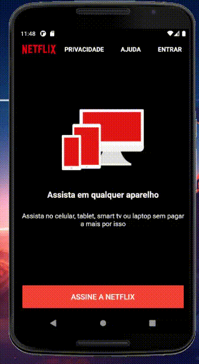

# netflix_clone

A Netflix UI Clone. In this project I've cloned a few pages of the Netflix Clone.

# My goal
My goal was to a clone of the Netflix UI App. For this project I decided to clone just three screens so I could practice what I've been learning over the past few months with flutter.

# What did I use
  For this project I've implemented a some flutter widgets such as:
 - ListView
 - PageView
 - Stack 
 - FlatButtons
